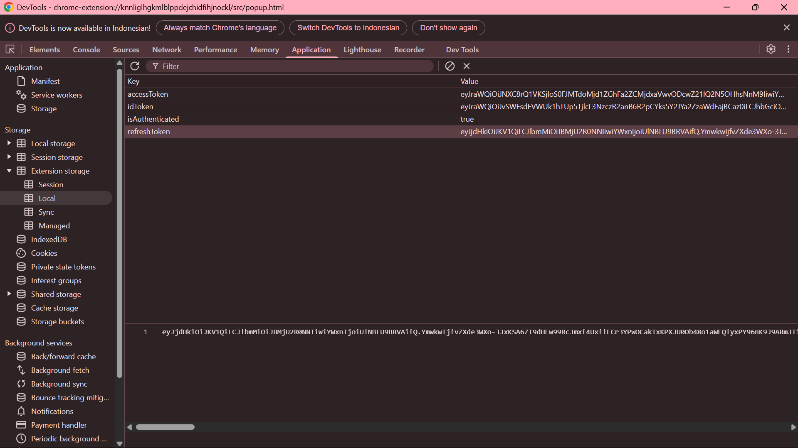

# Stork Verify BOT
Stork Verify BOT

- Register Here : [Stork Verify](https://chrome.google.com/webstore/detail/stork/knnliglhgkmlblppdejchidfihjnockl)
- Use Code: AUK36VZAMD

## Features

  - Auto Get Account Information
  - Auto Run With [Monosans](https://raw.githubusercontent.com/monosans/proxy-list/main/proxies/all.txt) Proxy - Choose 1
  - Auto Run With Private Proxy - Choose 2
  - Auto Run Without Proxy - Choose 3
  - Auto Reporting Messages
  - Multi Accounts With Threads

## Requiremnets

- Make sure you have Python3.9 or higher installed and pip.

## Instalation

1. **Clone The Repositories:**
   ```bash
   git clone https://github.com/Not-D4rkCipherX/Stork.git
   ```
   ```bash
   cd Stork
   ```

2. **Install Requirements:**
   ```bash
   pip install -r requirements.txt #or pip3 install -r requirements.txt
   ```

## Configuration

### How to get Refresh Token
<div style="text-align: center;">
  <h4><strong>Refresh Token</strong></h4>
  
</div>

## Accounts Setup
```bash
nano tokens.txt
```
- ** Make sure `tokens.txt` contains data that matches the format expected by the script. Here are examples of file formats:
  ```bash
  your_refresh_token_1
  your_refresh_token_2
  ```
## Proxy (Optional)
```bash
nano proxy.txt
```
- **  Make sure `proxy.txt` contains data that matches the format expected by the script. Here are examples of file formats:
  ```bash
  ip:port # Default Protcol HTTP.
  protocol://ip:port
  protocol://user:pass@ip:port
  ```

## Run

```bash
python bot.py #or python3 bot.py
```

## Buy Me a Coffee

- EVM:
```bash
0x47f41Fcb17cF9B7A02C26EE855d26bB8D3928E1b
```
- TON:
```bash
UQA-qG5eyQ7gVxvPDpy484xzc0UPS9a8hJsUAwe0T_3D7_oF
```
- SOL:
```bash
A1pUv13rRDtubtYJuXswZYSQBJojPhthXJftfNZBRnEX
```
- SUI:
```bash
0xeb697918d66c4ade867d61d0b8fb541df83675e8f60b6b81da8917aab149ee8f
```
